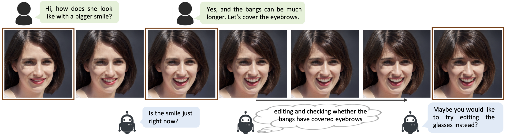
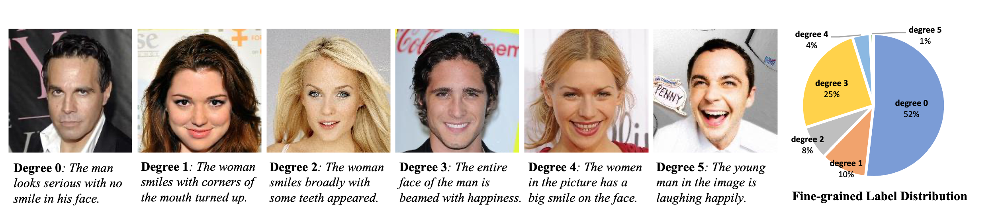

# Talk-to-Edit (ICCV2021)


This repository contains the implementation of the following paper:
> **Talk-to-Edit: Fine-Grained Facial Editing via Dialog**<br>
> Yuming Jiang<sup>∗</sup>, Ziqi Huang<sup>∗</sup>, Xingang Pan, Chen Change Loy, Ziwei Liu<br>
> IEEE International Conference on Computer Vision (**ICCV**), 2021<br>

[[Paper](https://arxiv.org/abs/2109.04425)]
[[Project Page](https://www.mmlab-ntu.com/project/talkedit/)]
[[CelebA-Dialog Dataset](https://mmlab.ie.cuhk.edu.hk/projects/CelebA/CelebA_Dialog.html)]
[[Poster](https://drive.google.com/file/d/1KaojezBNqDrkwcT0yOkvAgqW1grwUDed/view?usp=sharing)]
[[Video](https://www.youtube.com/watch?v=ZKMkQhkMXPI)]

You can try our colab demo here. Enjoy!
1. Editing with dialog: <a href="https://colab.research.google.com/drive/14inhJjrNIj_SdhIA7NEtGS2kKOWXXSjb?usp=sharing"></a>
1. Editing without dialog: <a href="https://colab.research.google.com/drive/1mO5NmlPi4YV359cPkLZnOpG_kShQi_hN?usp=sharing"></a>

## Overview



## Dependencies and Installation

1. Clone Repo

   ```bash
   git clone git@github.com:yumingj/Talk-to-Edit.git
   ```

1. Create Conda Environment and Install Dependencies

   ```bash
   conda env create -f environment.yml
   conda activate talk_edit
   ```
   - Python >= 3.7
   - PyTorch >= 1.6
   - CUDA 10.1
   - GCC 5.4.0


## Get Started

## Editing

We provide scripts for editing using our pretrained models.

1. First, download the pretrained models from this [link](https://drive.google.com/drive/folders/1W9dvjz8bUolEIG524o8ZvM62uEWKJ5do?usp=sharing) and put them under `./download/pretrained_models` as follows:
   ```
   ./download/pretrained_models
   ├── 1024_field
   │   ├── Bangs.pth
   │   ├── Eyeglasses.pth
   │   ├── No_Beard.pth
   │   ├── Smiling.pth
   │   └── Young.pth
   ├── 128_field
   │   ├── Bangs.pth
   │   ├── Eyeglasses.pth
   │   ├── No_Beard.pth
   │   ├── Smiling.pth
   │   └── Young.pth
   ├── arcface_resnet18_110.pth
   ├── language_encoder.pth.tar
   ├── predictor_1024.pth.tar
   ├── predictor_128.pth.tar
   ├── stylegan2_1024.pth
   ├── stylegan2_128.pt
   ├── StyleGAN2_FFHQ1024_discriminator.pth
   └── eval_predictor.pth.tar
   ```

1. You can try pure image editing without dialog instructions:
   ```bash
   python editing_wo_dialog.py \
      --opt ./configs/editing/editing_wo_dialog.yml \
      --attr 'Bangs' \
      --target_val 5
   ```
   The editing results will be saved in `./results`.

   You can change `attr` to one of the following attributes: `Bangs`, `Eyeglasses`, `Beard`, `Smiling`, and `Young(i.e. Age)`. And the `target_val` can be `[0, 1, 2, 3, 4, 5]`.

1. You can also try dialog-based editing, where you talk to the system through the command prompt:
   ```bash
   python editing_with_dialog.py --opt ./configs/editing/editing_with_dialog.yml
   ```
   The editing results will be saved in `./results`.

   **How to talk to the system:**
   * Our system is able to edit five facial attributes: `Bangs`, `Eyeglasses`, `Beard`, `Smiling`, and `Young(i.e. Age)`.
   * When prompted with `"Enter your request (Press enter when you finish):"`, you can enter an editing request about one of the five attributes. For example, you can say `"Make the bangs longer."`
   * To respond to the system's feedback, just talk as if you were talking to a real person. For example, if the system asks `"Is the length of the bangs just right?"` after one round of editing,  You can say things like `"Yes."` / `"No."` / `"Yes, and I also want her to smile more happily."`.
   * To end the conversation, just tell the system things like `"That's all"` / `"Nothing else, thank you."`

1. By default, the above editing would be performed on the teaser image. You may change the image to be edited in two ways: 1) change `line 11: latent_code_index` to other values ranging from `0` to `99`; 2) set `line 10: latent_code_path` to `~`, so that an image would be randomly generated.

1. If you want to try editing on real images, you may download the real images from this [link](https://drive.google.com/drive/folders/1BunrwvlwCBZJnb9QqeUp_uIXMxeXXJrY?usp=sharing) and put them under `./download/real_images`. You could also provide other real images at your choice. You need to change `line 12: img_path` in  `editing_with_dialog.yml` or `editing_wo_dialog.yml` according to the path to the real image and set `line 11: is_real_image` as `True`.

1. You can switch the default image size to `128 x 128` by setting `line 3: img_res` to `128` in config files.


## Train the Semantic Field


1. To train the Semantic Field, a number of sampled latent codes should be prepared and then we use the attribute predictor to predict the facial attributes for their corresponding images. The attribute predictor is trained using fine-grained annotations in [CelebA-Dialog](https://mmlab.ie.cuhk.edu.hk/projects/CelebA/CelebA_Dialog.html) dataset. Here, we provide the latent codes we used. You can download the train data from this [link](https://drive.google.com/drive/folders/1CYBpLIwts3ZVFiFAPb4TTnqYH3NBR63p?usp=sharing) and put them under `./download/train_data` as follows:
   ```
   ./download/train_data
   ├── 1024
   │   ├── Bangs
   │   ├── Eyeglasses
   │   ├── No_Beard
   │   ├── Smiling
   │   └── Young
   └── 128
       ├── Bangs
       ├── Eyeglasses
       ├── No_Beard
       ├── Smiling
       └── Young
   ```

1. We will also use some editing latent codes to monitor the training phase. You can download the editing latent code from this [link](https://drive.google.com/drive/folders/1G-0srCePEXcPq9HY38Il_4FTVHX_rOa-?usp=sharing) and put them under `./download/editing_data` as follows:

   ```
   ./download/editing_data
   ├── 1024
   │   ├── Bangs.npz.npy
   │   ├── Eyeglasses.npz.npy
   │   ├── No_Beard.npz.npy
   │   ├── Smiling.npz.npy
   │   └── Young.npz.npy
   └── 128
       ├── Bangs.npz.npy
       ├── Eyeglasses.npz.npy
       ├── No_Beard.npz.npy
       ├── Smiling.npz.npy
       └── Young.npz.npy
   ```

1. All logging files in the training process, *e.g.*, log message, checkpoints, and snapshots, will be saved to `./experiments` and `./tb_logger` directory.

1. There are 10 configuration files under `./configs/train`, named in the format of `field_<IMAGE_RESOLUTION>_<ATTRIBUTE_NAME>`.
Choose the corresponding configuration file for the attribute and resolution you want.

1. For example, to train the semantic field which edits the attribute `Bangs` in `128x128` image resolution, simply run:
   ```bash
   python train.py --opt ./configs/train/field_128_Bangs.yml
   ```


## Quantitative Results

We provide codes for quantitative results shown in Table 1. Here we use `Bangs` in `128x128` resolution as an example.

1. Use the trained semantic field to edit images.
   ```bash
   python editing_quantitative.py \
   --opt ./configs/train/field_128_bangs.yml \
   --pretrained_path ./download/pretrained_models/128_field/Bangs.pth
   ```

2. Evaluate the edited images using quantitative metircs. Change `image_num` for different attribute accordingly: `Bangs: 148`, `Eyeglasses: 82`, `Beard: 129`, `Smiling: 140`, `Young: 61`.
   ```bash
   python quantitative_results.py \
   --attribute Bangs \
   --work_dir ./results/field_128_bangs \
   --image_dir ./results/field_128_bangs/visualization \
   --image_num 148
   ```

## Qualitative Results


## CelebA-Dialog Dataset


Our [**CelebA-Dialog Dataset**](https://mmlab.ie.cuhk.edu.hk/projects/CelebA/CelebA_Dialog.html) is available for [Download](https://drive.google.com/drive/folders/18nejI_hrwNzWyoF6SW8bL27EYnM4STAs?usp=sharing).

**CelebA-Dialog** is a large-scale visual-language face dataset with the following features:
- Facial images are annotated with rich **fine-grained labels**, which classify one attribute into multiple degrees according to its semantic meaning.
- Accompanied with each image, there are **captions** describing the attributes and a **user request** sample.




The dataset can be employed as the training and test sets for the following computer vision tasks: fine-grained facial attribute recognition, fine-grained facial manipulation, text-based facial generation and manipulation, face image captioning, and broader natural language based facial recognition and manipulation tasks.


## Citation

   If you find our repo useful for your research, please consider citing our paper:

   ```bibtex
   @InProceedings{jiang2021talkedit,
     author = {Jiang, Yuming and Huang, Ziqi and Pan, Xingang and Loy, Chen Change and Liu, Ziwei},
     title = {Talk-to-Edit: Fine-Grained Facial Editing via Dialog},
     booktitle = {Proceedings of the IEEE/CVF International Conference on Computer Vision},
     year={2021}
   }
   ```

## Contact

If you have any question, please feel free to contact us via `yuming002@ntu.edu.sg` or `hu0007qi@ntu.edu.sg`.

## Acknowledgement

The codebase is maintained by [Yuming Jiang](https://yumingj.github.io/) and [Ziqi Huang](https://ziqihuangg.github.io/).

Part of the code is borrowed from [stylegan2-pytorch](https://github.com/rosinality/stylegan2-pytorch), [IEP](https://github.com/facebookresearch/clevr-iep) and [face-attribute-prediction](https://github.com/d-li14/face-attribute-prediction).

